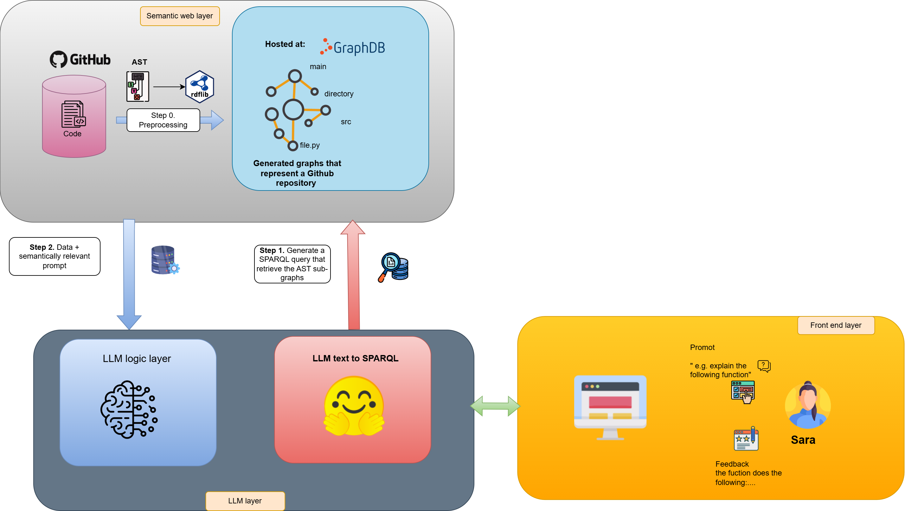

<!DOCTYPE html>
<html lang="en">
<head>
    <meta charset="UTF-8">
    <meta name="viewport" content="width=device-width, initial-scale=1.0">
    <title>GraphLoom Banner</title>
    <style>
        * {
            margin: 0;
            padding: 0;
            box-sizing: border-box;
        }

        .banner {
            width: 100%;
            height: 500px;
            background: radial-gradient(ellipse at center, #1a1a2e 0%, #0f0f23 70%, #000 100%);
            position: relative;
            overflow: hidden;
            display: flex;
            align-items: center;
            justify-content: center;
            font-family: 'Inter', 'Segoe UI', system-ui, sans-serif;
        }

        .neural-bg {
            position: absolute;
            top: 0;
            left: 0;
            width: 100%;
            height: 100%;
            background: 
                radial-gradient(circle at 10% 20%, rgba(64, 224, 208, 0.03) 0%, transparent 50%),
                radial-gradient(circle at 90% 80%, rgba(138, 43, 226, 0.03) 0%, transparent 50%),
                radial-gradient(circle at 50% 50%, rgba(0, 191, 255, 0.02) 0%, transparent 50%);
        }

        .grid-overlay {
            position: absolute;
            top: 0;
            left: 0;
            width: 100%;
            height: 100%;
            background-image: 
                linear-gradient(rgba(64, 224, 208, 0.05) 1px, transparent 1px),
                linear-gradient(90deg, rgba(64, 224, 208, 0.05) 1px, transparent 1px);
            background-size: 30px 30px;
            animation: gridPulse 4s ease-in-out infinite;
        }

        @keyframes gridPulse {
            0%, 100% { opacity: 0.3; }
            50% { opacity: 0.1; }
        }

        .graph-network {
            position: absolute;
            width: 100%;
            height: 100%;
        }

        .node {
            position: absolute;
            width: 6px;
            height: 6px;
            background: radial-gradient(circle, #00ffff 0%, #0080ff 100%);
            border-radius: 50%;
            box-shadow: 
                0 0 10px rgba(0, 255, 255, 0.8),
                0 0 20px rgba(0, 255, 255, 0.4),
                0 0 30px rgba(0, 255, 255, 0.2);
            animation: nodePulse 3s infinite ease-in-out;
        }

        .node-large {
            width: 10px;
            height: 10px;
            background: radial-gradient(circle, #ff0080 0%, #8000ff 100%);
            box-shadow: 
                0 0 15px rgba(255, 0, 128, 0.8),
                0 0 25px rgba(255, 0, 128, 0.4),
                0 0 35px rgba(255, 0, 128, 0.2);
        }

        .node:nth-child(1) { top: 15%; left: 12%; animation-delay: 0s; }
        .node:nth-child(2) { top: 25%; left: 88%; animation-delay: 0.5s; }
        .node:nth-child(3) { top: 75%; left: 8%; animation-delay: 1s; }
        .node:nth-child(4) { top: 85%; left: 92%; animation-delay: 1.5s; }
        .node:nth-child(5) { top: 45%; left: 5%; animation-delay: 0.25s; }
        .node:nth-child(6) { top: 35%; left: 95%; animation-delay: 0.75s; }
        .node:nth-child(7) { top: 60%; left: 15%; animation-delay: 2s; }
        .node:nth-child(8) { top: 20%; left: 70%; animation-delay: 2.5s; }

        .connection {
            position: absolute;
            height: 2px;
            background: linear-gradient(90deg, 
                rgba(0, 255, 255, 0.6) 0%, 
                rgba(255, 0, 128, 0.4) 50%, 
                rgba(0, 255, 255, 0.6) 100%);
            transform-origin: left center;
            border-radius: 1px;
            box-shadow: 0 0 8px rgba(0, 255, 255, 0.3);
            animation: connectionFlow 4s infinite ease-in-out;
        }

        .connection:nth-child(9) {
            top: 20%;
            left: 12%;
            width: 76%;
            transform: rotate(8deg);
            animation-delay: 0s;
        }

        .connection:nth-child(10) {
            top: 80%;
            left: 8%;
            width: 84%;
            transform: rotate(-5deg);
            animation-delay: 1s;
        }

        .connection:nth-child(11) {
            top: 50%;
            left: 5%;
            width: 25%;
            transform: rotate(45deg);
            animation-delay: 2s;
        }

        .connection:nth-child(12) {
            top: 25%;
            left: 70%;
            width: 22%;
            transform: rotate(-30deg);
            animation-delay: 1.5s;
        }

        @keyframes nodePulse {
            0%, 100% { 
                transform: scale(1); 
                opacity: 0.8; 
            }
            50% { 
                transform: scale(1.8); 
                opacity: 1; 
            }
        }

        @keyframes connectionFlow {
            0%, 100% { 
                opacity: 0.6; 
                transform: scaleX(1); 
            }
            50% { 
                opacity: 1; 
                transform: scaleX(1.1); 
            }
        }

        .content {
            text-align: center;
            z-index: 20;
            color: #ffffff;
            max-width: 900px;
            padding: 0 30px;
            position: relative;
        }

        .logo {
            font-size: 4.5rem;
            font-weight: 800;
            margin-bottom: 15px;
            letter-spacing: -0.02em;
            background: linear-gradient(135deg, 
                #00ffff 0%, 
                #ff0080 25%, 
                #8000ff 50%, 
                #00ff80 75%, 
                #0080ff 100%);
            background-size: 200% 200%;
            -webkit-background-clip: text;
            -webkit-text-fill-color: transparent;
            background-clip: text;
            animation: logoGradient 3s ease-in-out infinite;
            text-shadow: 0 0 30px rgba(0, 255, 255, 0.3);
            filter: drop-shadow(0 0 10px rgba(255, 0, 128, 0.2));
        }

        @keyframes logoGradient {
            0%, 100% { background-position: 0% 50%; }
            50% { background-position: 100% 50%; }
        }

        .tagline {
            font-size: 1.5rem;
            margin-bottom: 25px;
            font-weight: 400;
            color: #b0b0b0;
            letter-spacing: 0.5px;
            position: relative;
        }

        .tagline::after {
            content: '';
            position: absolute;
            bottom: -10px;
            left: 50%;
            transform: translateX(-50%);
            width: 60px;
            height: 2px;
            background: linear-gradient(90deg, transparent, #00ffff, transparent);
            border-radius: 1px;
        }

        .description {
            font-size: 1.1rem;
            line-height: 1.8;
            margin-bottom: 35px;
            font-weight: 300;
            color: #d0d0d0;
            max-width: 700px;
            margin-left: auto;
            margin-right: auto;
        }

        .highlight {
            color: #00ffff;
            font-weight: 500;
        }

        .tech-stack {
            display: flex;
            justify-content: center;
            gap: 15px;
            flex-wrap: wrap;
            margin: 30px 0;
        }

        .tech-item {
            background: rgba(0, 255, 255, 0.08);
            padding: 12px 20px;
            border-radius: 25px;
            font-size: 0.95rem;
            font-weight: 500;
            backdrop-filter: blur(15px);
            border: 1px solid rgba(0, 255, 255, 0.2);
            transition: all 0.4s cubic-bezier(0.4, 0, 0.2, 1);
            position: relative;
            overflow: hidden;
        }

        .tech-item::before {
            content: '';
            position: absolute;
            top: 0;
            left: -100%;
            width: 100%;
            height: 100%;
            background: linear-gradient(90deg, transparent, rgba(0, 255, 255, 0.1), transparent);
            transition: left 0.5s ease;
        }

        .tech-item:hover {
            background: rgba(0, 255, 255, 0.15);
            transform: translateY(-3px) scale(1.05);
            box-shadow: 
                0 10px 25px rgba(0, 255, 255, 0.2),
                0 0 20px rgba(0, 255, 255, 0.1);
            border-color: rgba(0, 255, 255, 0.4);
        }

        .tech-item:hover::before {
            left: 100%;
        }

        .university {
            margin-top: 30px;
            font-size: 1rem;
            color: #808080;
            font-weight: 400;
            letter-spacing: 0.5px;
        }

        .floating-elements {
            position: absolute;
            width: 100%;
            height: 100%;
            pointer-events: none;
        }

        .floating-code {
            position: absolute;
            font-family: 'JetBrains Mono', 'Fira Code', monospace;
            font-size: 11px;
            color: rgba(0, 255, 255, 0.4);
            background: rgba(0, 20, 40, 0.6);
            padding: 8px 12px;
            border-radius: 6px;
            border: 1px solid rgba(0, 255, 255, 0.2);
            backdrop-filter: blur(10px);
            animation: codeFloat 8s infinite ease-in-out;
        }

        .code-1 {
            top: 8%;
            right: 8%;
            animation-delay: 0s;
        }

        .code-2 {
            bottom: 10%;
            left: 5%;
            animation-delay: 3s;
        }

        .code-3 {
            top: 40%;
            right: 3%;
            animation-delay: 6s;
        }

        @keyframes codeFloat {
            0%, 100% { 
                transform: translateY(0px) translateX(0px) rotate(0deg); 
                opacity: 0.4; 
            }
            50% { 
                transform: translateY(-15px) translateX(5px) rotate(1deg); 
                opacity: 0.7; 
            }
        }

        .particles {
            position: absolute;
            width: 100%;
            height: 100%;
        }

        .particle {
            position: absolute;
            width: 2px;
            height: 2px;
            background: rgba(0, 255, 255, 0.6);
            border-radius: 50%;
            animation: particleFloat 6s infinite linear;
        }

        .particle:nth-child(1) { left: 10%; animation-delay: 0s; animation-duration: 8s; }
        .particle:nth-child(2) { left: 20%; animation-delay: 1s; animation-duration: 7s; }
        .particle:nth-child(3) { left: 30%; animation-delay: 2s; animation-duration: 9s; }
        .particle:nth-child(4) { left: 40%; animation-delay: 3s; animation-duration: 6s; }
        .particle:nth-child(5) { left: 50%; animation-delay: 1.5s; animation-duration: 8s; }
        .particle:nth-child(6) { left: 60%; animation-delay: 2.5s; animation-duration: 7s; }
        .particle:nth-child(7) { left: 70%; animation-delay: 0.5s; animation-duration: 9s; }
        .particle:nth-child(8) { left: 80%; animation-delay: 4s; animation-duration: 6s; }
        .particle:nth-child(9) { left: 90%; animation-delay: 3.5s; animation-duration: 8s; }

        @keyframes particleFloat {
            0% { 
                transform: translateY(500px) translateX(0px); 
                opacity: 0; 
            }
            10% { 
                opacity: 1; 
            }
            90% { 
                opacity: 1; 
            }
            100% { 
                transform: translateY(-50px) translateX(20px); 
                opacity: 0; 
            }
        }

        @media (max-width: 768px) {
            .banner { height: 400px; }
            .logo { font-size: 3rem; }
            .tagline { font-size: 1.2rem; }
            .description { font-size: 1rem; padding: 0 20px; }
            .tech-stack { gap: 10px; }
            .tech-item { padding: 8px 16px; font-size: 0.85rem; }
            .floating-code { font-size: 9px; padding: 6px 8px; }
        }
    </style>
</head>
<body>
    <div class="banner">
        <div class="neural-bg"></div>
        <div class="grid-overlay"></div>
        
        <div class="particles">
            <div class="particle"></div>
            <div class="particle"></div>
            <div class="particle"></div>
            <div class="particle"></div>
            <div class="particle"></div>
            <div class="particle"></div>
            <div class="particle"></div>
            <div class="particle"></div>
            <div class="particle"></div>
        </div>

        <div class="graph-network">
            <div class="node"></div>
            <div class="node node-large"></div>
            <div class="node"></div>
            <div class="node node-large"></div>
            <div class="node"></div>
            <div class="node"></div>
            <div class="node node-large"></div>
            <div class="node"></div>
            <div class="connection"></div>
            <div class="connection"></div>
            <div class="connection"></div>
            <div class="connection"></div>
        </div>

        <div class="floating-elements">
            <div class="floating-code code-1">
                def analyze_codebase():<br>
                &nbsp;&nbsp;graph = build_kg(repo)<br>
                &nbsp;&nbsp;return rag_query(graph)
            </div>

            <div class="floating-code code-2">
                // Hybrid RAG Architecture<br>
                const context = {<br>
                &nbsp;&nbsp;chunks: getCodeChunks(),<br>
                &nbsp;&nbsp;graph: getKnowledgeGraph()<br>
                }
            </div>

            <div class="floating-code code-3">
                query = """<br>
                MATCH (f:Function)-[r:CALLS]->(d:Dependency)<br>
                RETURN f.name, d.module<br>
                """
            </div>
        </div>

        <div class="content">
            <h1 class="logo">GraphLoom</h1>
            <p class="tagline">A Graph RAG Solution for Code Understanding</p>
            <p class="description">
                GraphLoom uses a <span class="highlight">hybrid light RAG approach</span>, combining code chunks for detailed context with knowledge graphs for structural relationships — transforming complex codebases from impenetrable mazes into <span class="highlight">clear, navigable maps</span>.
            </p>
            
            <div class="tech-stack">
                <span class="tech-item">Knowledge Graphs</span>
                <span class="tech-item">Retrieval-Augmented Generation</span>
                <span class="tech-item">LLM Integration</span>
                <span class="tech-item">Graph Neural Networks</span>
                <span class="tech-item">Streamlit UI</span>
            </div>

            <p class="university">Princess Sumaya University for Technology • Graduation Project 2024</p>
        </div>
    </div>
</body>
</html>
# [GraphLoom](https://drive.google.com/drive/folders/125z1exlm5WZHQAeCjUlHzaZLf1E48ukN) 

## Project Overview
Our project focuses on integrating Large Language Models (LLMs) with Knowledge Graphs (KGs) and Retrieval-Augmented Generation (RAG) techniques to create a hybrid system for enhanced information retrieval and decision making in software engineering. Our system tries to improve accuracy and relevancy of selected tasks: code generation, explanation, and documentation with a focus on security for all of them. We aim to deliver precise, context-aware, and enriched responses to complex queries, thus bridging the gap between abstract AI capabilities and practical software development needs.
## Approach
The recommended approach leverages a hybrid methodology combining LLM inference and KG construction. This ensures the system benefits from structured knowledge (KG) and adaptive generative reasoning (LLM).


<details>

## How can we imagine it?
```python
# example.py

def printfun():
  """This function just prints a message."""
  print("Hello from printfun!") # Built-in print

def loop():
  """This function loops 3 times and calls printfun."""
  for i in range(3):
     printfun() # Call to printfun

def run_loops(num_times):
  """Runs the loop function multiple times."""
  print(f"Running the loop {num_times} times.") # Built-in print
  for _ in range(num_times):
      loop() # Call to loop
  return f"Completed {num_times} loop runs."
```

Now, let's break down what goes where:

**1. What's Exactly in the Knowledge Graph (KG)**

The KG captures the *defined structure, components, and explicit connections* within the code. Think of it as the blueprint or map.

*   **Nodes (Entities):** Represent the core components defined in the code.
    *   **Node 1: `printfun`**
        *   `id`: `example.py:printfun` (Unique Identifier)
        *   `type`: Function
        *   `name`: "printfun"
        *   `file_path`: "example.py"
        *   `signature`: `() -> None` (No parameters, returns None)
        *   `docstring`: "This function just prints a message."
        *   `LLM-summary` (Example): "Outputs a static greeting."
    *   **Node 2: `loop`**
        *   `id`: `example.py:loop`
        *   `type`: Function
        *   `name`: "loop"
        *   `file_path`: "example.py"
        *   `signature`: `() -> None`
        *   `docstring`: "This function loops 3 times and calls printfun."
        *   `LLM-summary` (Example): "Iterates three times, invoking 'printfun' in each iteration."
    *   **Node 3: `run_loops`**
        *   `id`: `example.py:run_loops`
        *   `type`: Function
        *   `name`: "run_loops"
        *   `file_path`: "example.py"
        *   `signature`: `(num_times: Any) -> str` (Takes one parameter, returns a string. Type `Any` if not inferred precisely).
        *   `docstring`: "Runs the loop function multiple times."
        *   `LLM-summary` (Example): "Executes the 'loop' function a specified number of times and returns a completion message."
    *   *(Potentially)* **Node 4: `num_times` (Parameter)**
        *   `id`: `example.py:run_loops:param:num_times`
        *   `type`: Parameter
        *   `name`: "num_times"
        *   `belongs_to`: Node 3 (`run_loops`)
        *   `param_type`: `Any` (or inferred type)

*   **Edges (Relationships):** Represent the *connections* between the nodes.
    *   **Edge 1: `CALLS`**
        *   `Source`: Node 2 (`loop`)
        *   `Target`: Node 1 (`printfun`)
        *   `type`: CALLS
        *   `location`: `example.py:loop:line_7` (Approximate line number)
    *   **Edge 2: `CALLS`**
        *   `Source`: Node 3 (`run_loops`)
        *   `Target`: Node 2 (`loop`)
        *   `type`: CALLS
        *   `location`: `example.py:run_loops:line_13` (Approximate line number)
    *   *(Potentially)* **Edge 3: `HAS_PARAMETER`**
        *   `Source`: Node 3 (`run_loops`)
        *   `Target`: Node 4 (`num_times`)
        *   `type`: HAS_PARAMETER
    *   *(Potentially)* **Edge 4: `RETURNS`**
        *   `Source`: Node 3 (`run_loops`)
        *   `Target`: (Literal or Node representing `str` type)
        *   `type`: RETURNS

**KG Summary:** The KG stores discrete facts: "Function `loop` exists," "Function `loop` calls function `printfun`," "Function `run_loops` takes a parameter," "Function `run_loops` returns a string." It's excellent for precise, structural queries like "What functions call `loop`?" or "What parameters does `run_loops` take?".

---

**2. What's Exactly in the Vector Store (VS)**

The Vector Store captures the *semantic meaning* or *essence* of code blocks and their descriptions. Think of it as capturing the *vibe* or *purpose* for similarity matching.

*   **Code Chunk Embeddings:** Vectors representing the *meaning* of the executable code within each function.
    *   **Embedding 1 (`printfun` Code):** A vector generated from the code `print("Hello from printfun!")`. This vector numerically represents the concept of "printing a specific string".
        *   `Associated Data`: `chunk_id: example.py:printfun`, raw code.
    *   **Embedding 2 (`loop` Code):** A vector generated from `for i in range(3): printfun()`. This represents "looping a fixed number of times and calling another specific function (`printfun`)".
        *   `Associated Data`: `chunk_id: example.py:loop`, raw code.
    *   **Embedding 3 (`run_loops` Code):** A vector generated from the code inside `run_loops`: `print(f"Running the loop {num_times} times."); for _ in range(num_times): loop(); return f"Completed {num_times} loop runs."`. This represents "printing a dynamic message, looping based on a parameter, calling another specific function (`loop`), and returning a result string".
        *   `Associated Data`: `chunk_id: example.py:run_loops`, raw code.

*   **Entity Description Embeddings:** Vectors representing the *meaning* of the natural language descriptions (docstrings, summaries).
    *   **Embedding 4 (`printfun` Description):** A vector generated from text like "This function just prints a message. Outputs a static greeting.". Represents the concept described.
        *   `Associated Data`: `entity_id: example.py:printfun`.
    *   **Embedding 5 (`loop` Description):** A vector generated from text like "This function loops 3 times and calls printfun. Iterates three times, invoking 'printfun' in each iteration.". Represents the described concept.
        *   `Associated Data`: `entity_id: example.py:loop`.
    *   **Embedding 6 (`run_loops` Description):** A vector generated from text like "Runs the loop function multiple times. Executes the 'loop' function a specified number of times and returns a completion message.". Represents the described concept.
        *   `Associated Data`: `entity_id: example.py:run_loops`.

**VS Summary:** The Vector Store contains numerical fingerprints (embeddings) that allow for semantic similarity searches. It doesn't know explicitly that `run_loops` calls `loop`, but the *embedding* for `run_loops`'s code will likely be somewhat similar to other code that involves looping and calling functions, and its *description embedding* will be similar to other descriptions about executing tasks multiple times. It's great for fuzzy or conceptual queries like "Find code that repeatedly executes a task" or "Show me functions related to printing status messages".

---

**How Retrieval Uses Both:**

*   **Query:** "What calls the `loop` function?"
    *   **Action:** Primarily a KG query. Find nodes with `CALLS` edges pointing *to* the `loop` node.
    *   **Result:** The `run_loops` node.
*   **Query:** "Find code examples for running something multiple times based on input."
    *   **Action:** Embed the query. Primarily a VS search. Compare query embedding against Code Chunk Embeddings and potentially Description Embeddings.
    *   **Result:** Embedding 3 (`run_loops` code) and Embedding 6 (`run_loops` description) would likely score high.
*   **Query:** "Show me the function that runs `printfun` three times and how it's used."
    *   **Action (Hybrid):**
        1.  VS Search (optional): Find entities related to "`printfun` three times" -> might highlight `loop`.
        2.  KG Query: Find the `loop` node. Find incoming `CALLS` edges to `loop` -> finds `run_loops`. Find outgoing `CALLS` edges from `loop` -> finds `printfun`.
    *   **Result:** Identify `loop` as the direct function, `run_loops` as its caller, and `printfun` as what it calls, presenting the relevant code and connections.


<details>
  <summary>Click to expand</summary>
  
## [How to Evaluate?](Evaluation)

Here’s a summarized table of all evaluation metrics covering the overall project, the "text to Cypher" component, and the knowledge graph itself. This consolidates metrics from retrieval, generation, user studies, task-specific evaluation, text-to-Cypher translation, and knowledge graph quality.
| **Metric**                     | **Type**          | **Description**                                                                                   | **Application Context**                                                                                   |
|-------------------------------|-------------------|---------------------------------------------------------------------------------------------------|-----------------------------------------------------------------------------------------------------------|
| **Precision**                 | [Retrieval](Evaluation/Evaluation_retrieval_generation.md)         | Proportion of retrieved code structures (e.g., functions, dependencies) that are relevant.         | Assesses quality of subgraphs retrieved from Neo4j for queries like "Explain the merge_sort function."    |
| **Recall**                    | [Retrieval](Evaluation/Evaluation_retrieval_generation.md)         | Proportion of relevant code structures retrieved out of all relevant ones available.              | Ensures completeness of retrieved subgraphs, critical for full code context understanding.               |
| **Mean Reciprocal Rank (MRR)**| [Retrieval](Evaluation/Evaluation_retrieval_generation.md)        | Evaluates rank of the first relevant result in retrieved subgraphs, averaged across queries.       | Measures how quickly the system finds the most relevant code piece, useful for multi-hop queries.        |
| **Faithfulness**              | [Generation](Evaluation/Evaluation_retrieval_generation.md)        | Assesses if LLM outputs (e.g., explanations, code) are grounded in retrieved subgraphs, avoiding hallucinations. | Ensures generated responses align with codebase structure, reducing errors.                              |
| **BLEU Score**                | [Generation](Evaluation/Evaluation_retrieval_generation.md) / [Translation](Text2cypher.md) | Compares n-grams of generated text (e.g., code, Cypher queries) to reference text, ranges 0-1.   | Evaluates textual similarity of generated code/docs or Cypher queries against expected outputs.          |
| **ROUGE Score**               |[Generation](Evaluation/Evaluation_retrieval_generation.md)        | Measures overlap of n-grams, longest common subsequences between generated and reference text.     | Assesses quality of generated documentation or explanations, complementing BLEU.                         |
| **ExactMatch (EM)**           | Execution / [Translation](Text2cypher.md) | Compares execution results of generated vs. reference Cypher queries or code, binary 0 or 1.     | Ensures functional correctness of Cypher queries or generated code snippets when run on Neo4j.           |


## Structural (KG) [Evaluation](Evaluation/KG_Evaluation.md)
| **Metric**                     | **Type**          | **Description**                                                                                   | **Application Context**                                                                                   |
|-------------------------------|-------------------|---------------------------------------------------------------------------------------------------|-----------------------------------------------------------------------------------------------------------|
| **Node Count Accuracy**       | Structural (KG)   | Compares number of nodes (e.g., functions, classes) in graph to source code, measures coverage.    | Ensures all code entities are captured in the knowledge graph, critical for completeness.                |
| **Edge Accuracy (Relationships)** | Structural (KG) | Verifies relationships (e.g., CALLS, INHERITS) in graph match those extracted from code.         | Checks if call graphs and inheritance hierarchies are correct, essential for query accuracy.             |
| **Call Graph Coverage**       | Completeness (KG) | Percentage of function calls in code represented as edges in graph.                               | Measures how well dynamic relationships are captured, impacting query results like "functions called by X."|
| **Schema Adherence**          | Semantic (KG)     | Assesses if nodes and edges follow expected types (e.g., Function node has name property).         | Ensures graph follows codebase ontology, supporting reliable querying and retrieval.                     |
| **Query Success Rate**        | Utility (KG)      | Percentage of test queries (e.g., "Show callers of function") returning expected results.          | Validates graph utility for developer tasks, ensuring it supports GraphRag retrieval effectively.         |

### Notes
- **Retrieval Metrics** (Precision, Recall, MRR): Evaluate the Graph-RAG retrieval from Neo4j, ensuring relevant code subgraphs are retrieved.
- **Generation Metrics** (Faithfulness, BLEU, ROUGE): Assess LLM outputs (explanations, code, docs) for accuracy and relevance.
- **Translation Metrics** (BLEU, ExactMatch): Focus on "text to Cypher" translation, checking textual and functional accuracy of Cypher queries.
- **Task-Specific/User Metrics** (F1, Time, Satisfaction): Measure overall system impact on developer tasks and experience.
- **Knowledge Graph (KG) Metrics** (Node Count Accuracy, Edge Accuracy, Call Graph Coverage, Schema Adherence, Query Success Rate): Assess the graph’s accuracy, completeness, semantic quality, and utility, ensuring it supports the system’s foundation.

